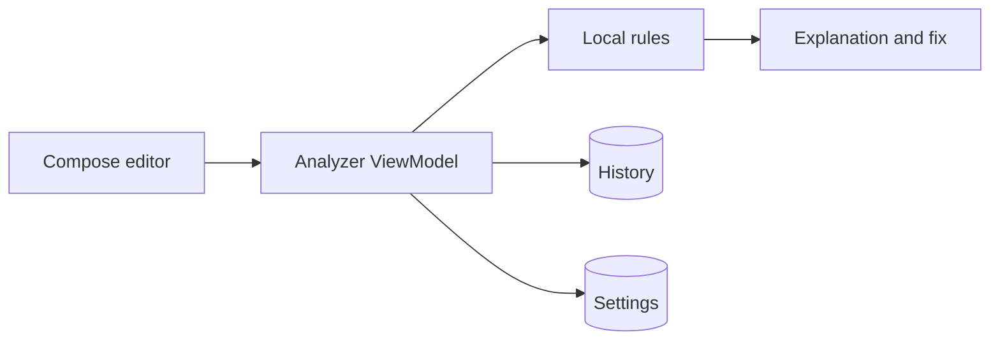

# CodeSensei

Native Android learning app that gives beginners fast, explainable feedback on Kotlin code.

[Watch the demo](https://youtu.be/Di1P4Hz05n4)

CodeSensei is deliberately local-first: its current analyzer uses deterministic rules to identify common beginner mistakes, explain what happened, and suggest a concrete fix. That makes every result inspectable instead of hiding feedback behind an opaque remote model.

## Engineering proof

| Area | Implementation |
| --- | --- |
| UI | Kotlin and Jetpack Compose with light/dark themes |
| State | ViewModel-driven screen and analysis state |
| Persistence | Room for analysis history and DataStore for settings |
| Navigation | Navigation Compose |
| Analysis | Local, deterministic rules with explanations and suggested fixes |
| Platform | Compile/target SDK 36; minimum SDK 24 |

## Current capabilities

- Compose-based editor and results experience
- Local checks for common beginner errors, including misspelled output calls, missing entry points, and unbalanced parentheses
- Human-readable explanation and suggested correction for each finding
- Learning points and saved analysis history
- Persistent settings and theme support
- No account or network connection required for the current analyzer

## Architecture



## Screens

| Home | Results |
| --- | --- |
|  |  |
| History | Settings |
|  |  |

Dark-mode variants are also implemented in the app.

## Run locally

1. Clone the repository.
2. Open it in a current Android Studio release.
3. Install Android SDK 36.
4. Sync Gradle and run the `app` configuration on an emulator or device running API 24+.

Command-line verification:

```bash
./gradlew assembleDebug
./gradlew test
```

## Repository map

```text
CodeSensei/
├── app/src/main/       Compose UI, state, storage, and analyzer logic
├── app/src/test/       Local unit-test source set
├── gradle/             Gradle wrapper configuration
└── README.md           Product and engineering overview
```

## Scope and next steps

The current rule engine is intentionally small and deterministic; it is not a Kotlin compiler or production static-analysis replacement. The test source set currently contains starter scaffolding. Strong next steps are rule-level unit coverage, parser-backed diagnostics, accessibility tests, and opt-in AI explanations with clear provenance.

## Author

Built by [Muhammad Imran](https://github.com/Muhammad7839) — [portfolio](https://muhammad7839.github.io/portfolio) · [LinkedIn](https://www.linkedin.com/in/muhammadimran-swe/)
